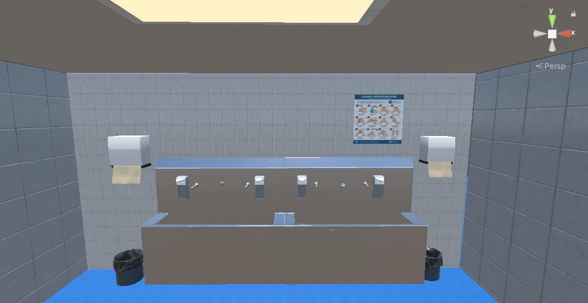
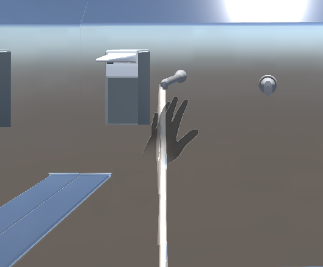
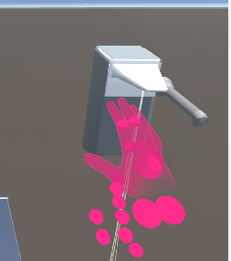
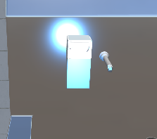
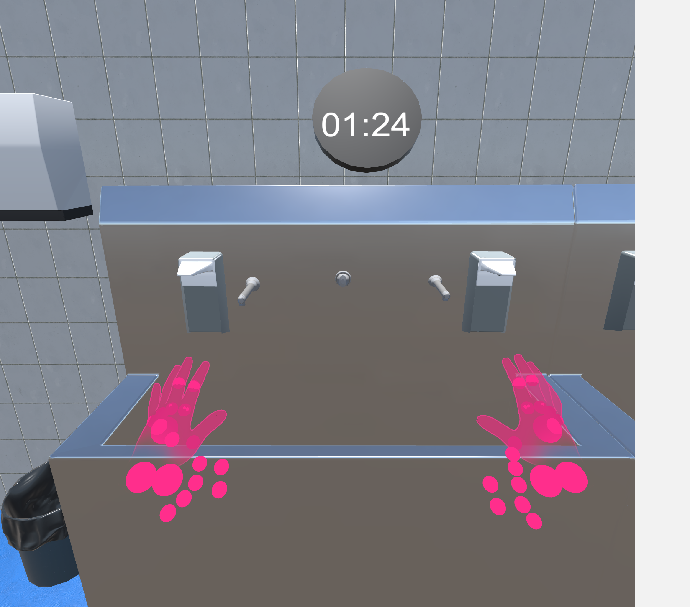
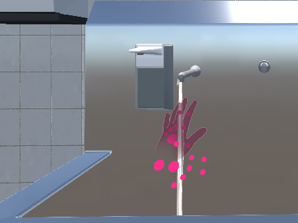
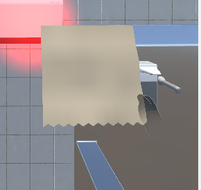
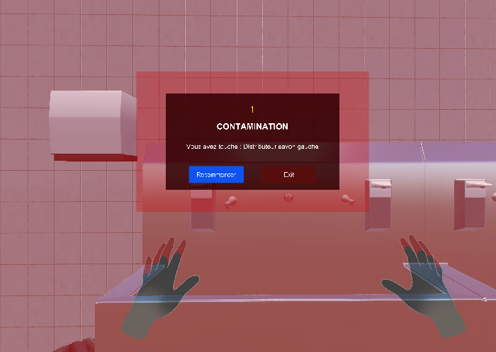
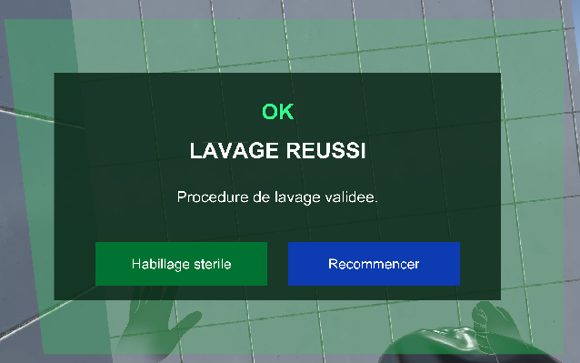
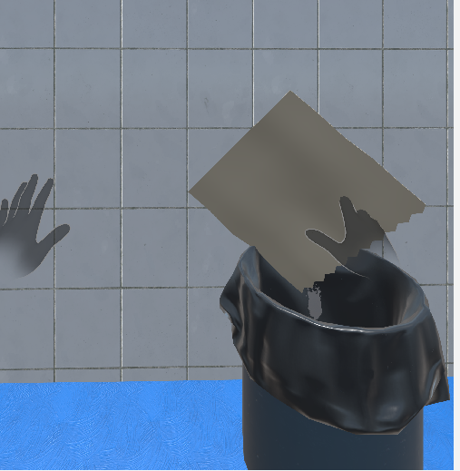

# PFA_Project

Simulation VR de formation médicale

## Description

Ce projet Unity présente une simulation de formation médicale en réalité virtuelle. Il inclut une scène dédiée à la salle de lavage modélisée en 3D, ainsi qu'une séquence d'étapes de lavage des mains.

## Contenu principal

- `Assets/` : ressources Unity (scènes, scripts, modèles, matériaux, etc.)
- `capture_etape_lavage_scene/` : captures d'écran des étapes de lavage et de la salle de lavage
- `PFA_project.sln` : solution Visual Studio pour le projet Unity

## Dossier de captures

Le dossier `capture_etape_lavage_scene/` contient :

- `SalledeLavagedansUnity.png` : vue générale de la salle de lavage dans Unity
- `scene_01_robinet.png` : capture de l'étape du robinet
- `scene_02_soapdispenser_detection.png` : détecteur du distributeur de savon
- `scene_03_halo_savon.png` : visualisation du savon
- `scene_04_frottage_minuteur.png` : étape de frottage avec minuteur
- `scene_05_rincage.png` : étape de rinçage
- `scene_06_sechage_tissu.png` : étape de séchage avec un tissu
- `scene_failmenu_contamination.png` : écran d'échec lié à la contamination
- `succeedmenu.png` : écran de réussite
- `Trushzone.png` : zone de poubelle / déchet

### Aperçu des captures

## Utilisation

1. Téléchargez/clônez le projet.
2. Ouvrez le dossier du projet dans Unity Editor 2022.
3. Chargez la scène appropriée pour visualiser la simulation VR.

> Il n'est pas nécessaire d'ouvrir `PFA_project.sln` si vous utilisez seulement Unity. Ce fichier est utile uniquement pour éditer le code C# dans Visual Studio.

## Remarques

Ce `README.md` a été mis à jour pour décrire les nouvelles captures et la salle de lavage modélisée.
